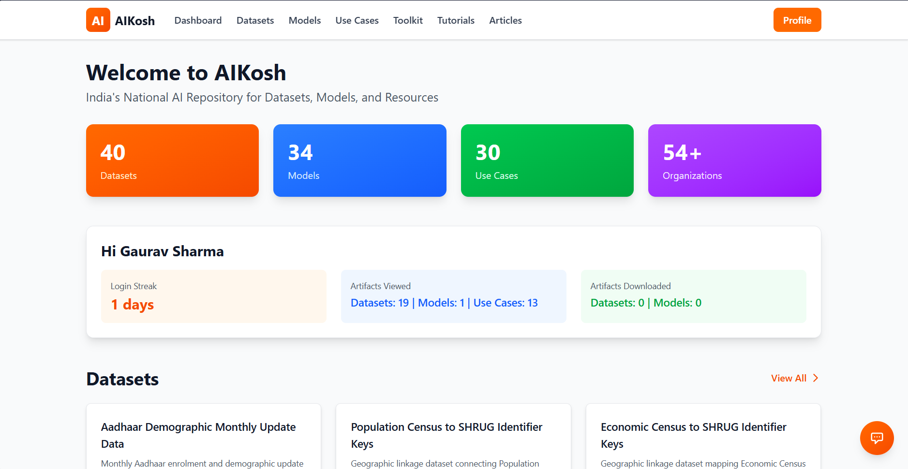
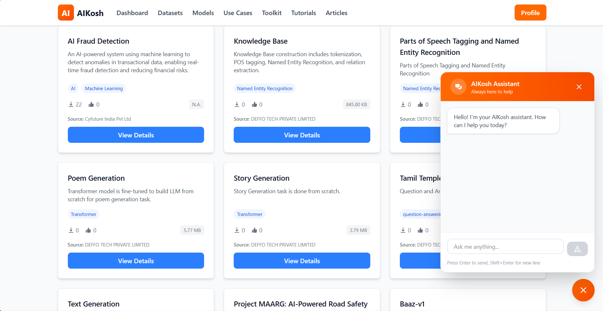

<h1 align="center">AIKosh</h1>

<p align="center">
  
</p>

<p align="center">
  
</p>

## Overview

**AIKosh** is India's National AI Repository for datasets, models, and resources. This is an enhanced clone of the original AIKosh platform with significant personal touches and additional features, most notably an **intelligent RAG-powered chatbot** that helps users navigate through the vast collection of AI resources.

The platform aggregates **40 datasets**, **34 AI models**, and **31 use cases** along with articles, tutorials, and toolkits, making it challenging for users to find the right resources. Our AI chatbot solves this by providing curated, context-aware recommendations based on user queries.

## What Makes This Special

### Intelligent AI Chatbot
The core feature of this project is an AI-powered assistant that:
- Takes natural language questions from users about their specific problems
- Searches through all available datasets, models, use cases, and articles using RAG (Retrieval-Augmented Generation)
- Provides curated, contextual answers with relevant resource recommendations
- Renders responses in beautiful markdown format with proper headings, lists, and formatting
- Supports streaming responses with the ability to stop mid-generation
- **Future Enhancement**: Multilingual support for regional languages (Hindi, Bengali, Tamil) using Sarvam AI's language capabilities

### Blazing Fast Rust Backend
The backend is built with Rust and the Axum framework, chosen for:
- **Superior Performance**: 3-5x faster than Node.js/Nest.js in request handling
- **High Concurrency**: Efficiently handles thousands of concurrent requests with minimal resource usage
- **Memory Safety**: Zero-cost abstractions and compile-time guarantees prevent runtime errors
- **Low Latency**: Sub-millisecond response times for API endpoints

### Powered by Sarvam AI
After extensive testing with multiple LLM providers, **Sarvam AI** was chosen as the AI backbone because:
- Best understanding of Indian context and terminology
- Excellent performance with technical and domain-specific queries
- Reliable API with consistent response quality
- Optimized for Indian datasets and use cases
- Native support for Indian languages (future implementation)

## Architecture

```
AIKosh/
├── Backend (Rust + Axum)       → High-performance REST API
├── Frontend (React + Vite)     → Modern, responsive UI
└── Chatbot (Python + FastAPI)  → RAG-powered AI assistant
```

The three services communicate as follows:

```
Browser
  └── React Frontend (Port 5173)
        ├── Rust Backend (Port 3000)  →  Reads JSON data files
        └── Python Chatbot (Port 8000) →  RAG search via Sarvam AI API
```

- The **React frontend** is what the user sees and interacts with in the browser.
- It talks to the **Rust backend** for fetching datasets, models, use cases, articles, and other data.
- It talks to the **Python chatbot** when the user asks a question, which performs RAG search and returns an AI-generated answer.
- All three services must be running at the same time for the platform to work fully.

### Tech Stack
- **Backend**: Rust, Axum, Tokio, Tower, Serde
- **Frontend**: React, TypeScript, Vite, TailwindCSS, React Router, React Markdown
- **Chatbot**: Python, FastAPI, Sentence Transformers, FAISS, Sarvam AI API
- **Data Storage**: JSON files (40 datasets, 34 models, 31 use cases)

## Prerequisites

Before running this project, ensure you have the following installed:

### 1. Rust
Visit [https://rustup.rs](https://rustup.rs) in your browser and follow the instructions for your operating system to download and install Rust.

```bash
# Verify installation
cargo --version
```

### 2. Node.js and pnpm
```bash
# Install Node.js 18+ from: https://nodejs.org/
node --version

# Install pnpm
npm install -g pnpm
pnpm --version
```

### 3. Python 3.10+
```bash
# Install Python from: https://www.python.org/downloads/
python --version

# Verify pip is installed
pip --version
```

### 4. Sarvam AI API Key
Get your free API key from [Sarvam AI](https://www.sarvam.ai/) and configure it in the chatbot's `.env` file.

## Getting Started

### Step 1: Clone the Repository
```bash
git clone https://github.com/Gaurav-Sharmaa/AIKosh.git
cd AIKosh
```

### Step 2: Setup Chatbot (Terminal 1)
Follow the detailed instructions in the [`chatbot/README.md`](chatbot/README.md) file:
```bash
cd chatbot
python -m venv .venv
```

Activate the virtual environment:
```bash
# Windows
.venv\Scripts\activate

# Linux/Mac
source .venv/bin/activate
```

> **Why a virtual environment?** It keeps the chatbot's Python dependencies isolated from the rest of your system. This means installing packages here won't affect other Python projects on your machine, and you can always delete the `.venv` folder to start fresh without any side effects.

```bash
pip install -r requirements.txt
```

Create a `.env` file inside the `chatbot/` folder and add your Sarvam API key:
```bash
# chatbot/.env
SARVAM_API_KEY=your_actual_api_key_here
```

> **Important:** Without this `.env` file in the `chatbot/` directory, the chatbot will fail to start. Replace `your_actual_api_key_here` with the key you got from [Sarvam AI](https://www.sarvam.ai/).

```bash
python app.py
```

The chatbot API will run on `http://localhost:8000`

### Step 3: Run Backend (Terminal 2)
```bash
# From project root
cargo run --release
```

The Rust backend will run on `http://localhost:3000/api`

### Step 4: Run Frontend (Terminal 3)
```bash
cd frontend
pnpm install
pnpm run dev
```

The React app will run on `http://localhost:5173`

### Running All Services
You need **3 terminals** running simultaneously:
1. **Terminal 1**: `cargo run --release` (Rust backend - Port 3000)
2. **Terminal 2**: `cd frontend && pnpm run dev` (React frontend - Port 5173)
3. **Terminal 3**: `cd chatbot && python app.py` (Python chatbot - Port 8000)

## Project Structure

```
AIKosh/
├── src/                    # Rust backend source
│   ├── main.rs            # Server setup & routes
│   ├── models.rs          # Data structures
│   ├── handlers.rs        # API handlers
│   └── errors.rs          # Error handling
├── frontend/              # React frontend
│   ├── src/
│   │   ├── components/    # React components
│   │   ├── pages/         # Page components
│   │   ├── services/      # API services
│   │   └── types/         # TypeScript types
│   └── package.json
├── chatbot/               # Python RAG chatbot
│   ├── app.py            # FastAPI application
│   ├── requirements.txt  # Python dependencies
│   └── README.md         # Chatbot setup guide
├── data/                 # JSON data files
│   ├── datasets.json     # 40 datasets
│   ├── models.json       # 34 AI models
│   ├── usecases.json     # 31 use cases
│   ├── articles.json     # Articles
│   ├── tutorials.json    # Tutorials
│   ├── toolkit.json      # Toolkits
│   └── dashboard.json    # Dashboard data
├── Cargo.toml            # Rust dependencies
└── README.md
```

## Features

### Current Features
- Browse 40+ datasets with detailed information
- Explore 34+ AI models with specifications
- Discover 31+ real-world use cases
- Read articles and tutorials
- Responsive, modern UI built with React and TailwindCSS
- Blazing fast Rust backend with RESTful APIs
- **AI Chatbot** with RAG-based intelligent search
- Markdown rendering for beautiful, formatted responses
- Streaming responses with stop functionality
- Context-aware recommendations from all resources

## API Documentation

### Service Ports & Architecture

This project runs on **3 separate services** on different ports:

| Service            | Port | Base URL                    | Purpose                                  |
| ------------------ | ---- | --------------------------- | ---------------------------------------- |
| **Rust Backend**   | 3000 | `http://localhost:3000/api` | REST API for datasets, models, use cases |
| **React Frontend** | 5173 | `http://localhost:5173`     | User interface                           |
| **Python Chatbot** | 8000 | `http://localhost:8000`     | RAG-powered AI assistant API             |

**Why separate services?**
- **Backend (Rust)**: Handles data retrieval from JSON files with blazing-fast performance
- **Chatbot (Python)**: RAG requires Python libraries (FAISS, Sentence Transformers) which aren't available in Rust
- **Frontend (React)**: Communicates with both Backend and Chatbot APIs


## CORS Configuration

The Rust backend (`src/main.rs`) includes a CORS layer that allows requests from the React frontend running on `http://localhost:5173`. If you change any service's port or deploy to a server, you will need to update the allowed origins in `main.rs` to match the new frontend URL — otherwise the browser will block API requests with a CORS error.

## Common Issues

**Port already in use**
If you see an error like `Address already in use`, another process is occupying that port. Find and stop it.

**Chatbot fails to start / API key error**
Make sure you have created the `.env` file inside the `chatbot/` directory (not the project root) and that it contains your valid Sarvam API key:
```
SARVAM_API_KEY=your_actual_api_key_here
```

**Python version mismatch**
This project requires Python 3.10 or higher. Check your version with `python --version`. If you have multiple Python versions installed, make sure you are creating the virtual environment with the correct one:
```bash
python3.10 -m venv .venv
```

**`pnpm` command not found**
You need Node.js installed first, then install pnpm globally:
```bash
npm install -g pnpm
```

**Rust build errors**
Make sure your Rust toolchain is up to date:
```bash
rustup update
```

**Chatbot returns no results / poor answers**
The chatbot builds its index from the JSON files in the `data/` directory. Make sure those files are present and not empty. If you modified any data files, restart the chatbot service so it re-indexes.

## Contributing

Contributions are welcome! Feel free to open issues or submit pull requests.

## License

This project is licensed under the MIT License - see the [LICENSE](LICENSE) file for details.

## Acknowledgments

- Original [AIKosh](https://aikosh.ai/) platform by the Government of India
- [Sarvam AI](https://www.sarvam.ai/) for their excellent LLM API
- The Rust, React, and Python communities

---

<p align="center">Made with love for India's AI ecosystem</p>